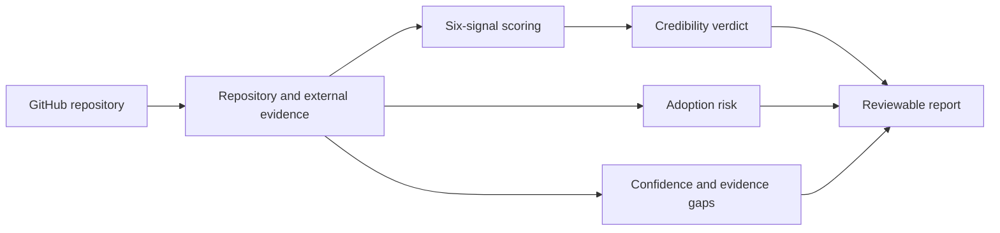

<h1 align="center">github-check</h1>

<p align="center"><strong>Check whether a GitHub project is trustworthy and worth using.</strong></p>

<p align="center">
  Go beyond stars: inspect code, community, claims, and adoption risk, with explicit evidence gaps.
</p>

<p align="center">
  <a href="README.md">简体中文</a> · <strong>English</strong> ·
  <a href="https://github.com/2025chunxi/github-check/releases/tag/v0.3.0-beta">Download v0.3.0-beta</a> ·
  <a href="https://github.com/2025chunxi/github-check/issues">Report an issue</a>
</p>

<p align="center">
  <a href="https://github.com/2025chunxi/github-check/actions/workflows/ci.yml"></a>
  <a href="https://github.com/2025chunxi/github-check/releases/tag/v0.3.0-beta"></a>
  <a href="LICENSE"></a>
  
</p>

## The Question Is Not How Many Stars It Has

When a repository suddenly becomes popular, four separate questions affect the decision:

| Question | What this Skill reports |
|---|---|
| Is the project itself credible? | A weighted verdict and score across six evidence signals |
| Is the popularity suspicious? | Star integrity, trajectory, external adoption, and alternative explanations |
| Is it ready for production adoption? | Separate maintenance, security, license, and compatibility risks |
| How reliable is the conclusion? | High/medium/low confidence plus uncollected evidence |



## What a Real Report Looks Like

A `standard` audit of [`encode/httpx@b5addb6`](https://github.com/encode/httpx/tree/b5addb64f0161ff6bfe94c124ef76f6a1fba5254) produced:

```text
Credibility verdict: CREDIBLE
Weighted score: 84/100
Adoption risk: LOW, 5/100
Confidence: MEDIUM
Action: Reasonable to evaluate for adoption; still check compatibility, security, and license fit.
```

| Result | Why |
|---|---|
| **Credibility 84/100** | Implementation, tests, CI, releases, contributors, and registry evidence support one another |
| **Adoption risk 5/100** | The automated audit found one factor: no `SECURITY.md` policy detected |
| **Confidence medium** | Repository, code tree, activity, contributors, releases, CI, license, and PyPI were covered |
| **Explicit limitation** | No deep stargazer timestamp sample or broad search for independent mentions was performed |

That limitation is intentional: missing evidence lowers confidence instead of being replaced with a confident-sounding guess.

## Six Signals, Not One Accusatory Metric

| Signal | Core question |
|---|---|
| A. Star integrity | Is the popularity trajectory plausible, and is there direct manipulation evidence or a credible alternative explanation? |
| B. Claim verifiability | Can README, website, and benchmark claims be checked against code, docs, or independent sources? |
| C. Code substance | Do implementation, tests, history, CI, and releases support what the project claims? |
| D. Community substance | Do forks, contributors, PRs, downloads, and independent use indicate real adoption? |
| E. Marketing vs implementation | Does promotion describe shipped capability rather than roadmap items or vague slogans? |
| F. Commercial conflicts | Do incentives distort social proof? Commercial open source is not penalized by itself. |

Severe A=1 or B=1 overrides require direct evidence and exact quotes. A star/fork ratio, growth spike, or promotional tone alone does not prove purchased stars.

## Why This Is Not Another Star Detector

| Star-only detector | `github-check` |
|---|---|
| Labels a project from one ratio or anomaly curve | Checks code, community, claims, marketing, commercial incentives, and external adoption |
| Treats “credible” as “production-ready” | Keeps credibility and adoption risk completely separate |
| Ignores differences among new projects, content repos, and viral launches | Adjusts for new repos, forks, archives, awesome lists, datasets, and similar repository types |
| Gives a definite answer when evidence is thin | Reports confidence, sources, and manual collection gaps |
| Lets the model improvise a score | Uses a deterministic scorer, override rules, fixed-commit calibration, and a negative control |

## Three Audit Depths

| Mode | Best for | Automated collection |
|---|---|---|
| `quick` | Fast screening | GitHub core metrics and adoption-risk precheck |
| `standard` | **Recommended default** | Core metrics plus auto-detected npm / PyPI / crates records |
| `deep` | Popular, disputed, or high-risk adoption decisions | Everything in `standard` plus authenticated stargazer timestamp sampling |

## Install in 30 Seconds

### Option 1: Ask Codex to install it

Send this in Codex:

```text
Use $skill-installer to install:
https://github.com/2025chunxi/github-check/tree/main/skill/github-check
```

Start a new task, then try:

```text
Use $github-check in standard mode to evaluate https://github.com/owner/repo.
Keep credibility and adoption risk separate, and report sources, confidence, and missing evidence.
```

### Option 2: Download the release

Download [`github-check.skill`](https://github.com/2025chunxi/github-check/releases/download/v0.3.0-beta/github-check.skill), extract its top-level `github-check` directory into `$CODEX_HOME/skills` (default: `~/.codex/skills`), and start a new Codex task to load the Skill.

## The Output Is More Than a Label

The final JSON and Markdown reports include:

- Credibility verdict, weighted score, and full calculation.
- Six-signal scorecard with evidence sources.
- Separate adoption-risk score and contributing factors.
- Confidence, collection timestamp, and uncovered scope.
- Recommended action: adopt, watch, avoid, or request vendor/security review first.

## Build and Verify Locally

Requires Python 3.11+. PyYAML is used only by repository release tooling:

```bash
python -m pip install -r requirements.txt
python scripts/build_release.py
```

The output is `dist/github-check.skill`. The build runs scoring regression tests, strict Skill validation, eight calibration cases, archive integrity checks, and repository-wide scans for secrets, PII, local paths, and unsafe archives. CI excludes live GitHub calls.

## Authentication, Privacy, and Evidence Boundaries

- `GITHUB_TOKEN` is optional and supports higher API limits, private repos, and `deep` sampling.
- The token is read from the environment, used only in request headers, and never written to reports.
- Star anomalies and ratios alone do not prove purchased or automated stars.
- A credible repository can still carry maintenance, security, license, or compatibility risk.
- Missing external evidence must lower confidence; it must not be silently invented.
- Run current security, license, and compatibility checks before production adoption.

## Project Status

The current release is `v0.3.0-beta`. This release adopts the final Skill name `github-check`; evidence collection, deterministic scoring, and calibration paths are covered by automated tests.

Open an [Issue](https://github.com/2025chunxi/github-check/issues) or read [CONTRIBUTING.md](CONTRIBUTING.md) to contribute.

## License

[MIT](LICENSE)
