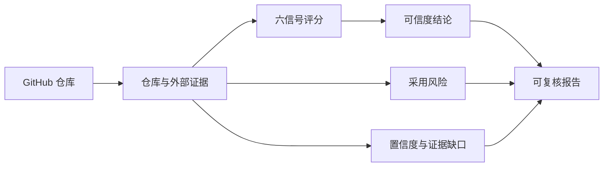

<h1 align="center">repo-trust</h1>

<p align="center"><strong>判断 GitHub 项目是否可信、是否值得用。</strong></p>

<p align="center">
  不只看 Star：同时检查代码、社区、宣传与采用风险，并明确证据不足。
</p>

<p align="center">
  <strong>简体中文</strong> · <a href="README.en.md">English</a> ·
  <a href="https://github.com/2025chunxi/repo-trust/releases/tag/v0.2.0-beta">下载 v0.2.0-beta</a> ·
  <a href="https://github.com/2025chunxi/repo-trust/issues">反馈问题</a>
</p>

<p align="center">
  <a href="https://github.com/2025chunxi/repo-trust/actions/workflows/ci.yml"></a>
  <a href="https://github.com/2025chunxi/repo-trust/releases/tag/v0.2.0-beta"></a>
  <a href="LICENSE"></a>
  
</p>

## 你真正想知道的，不是它有多少 Star

看到一个突然热门的仓库时，真正影响决策的是四个不同问题：

| 问题 | 本 Skill 的回答 |
|---|---|
| 项目本身可信么？ | 六类信号加权后的可信度结论与分数 |
| 热度有没有可疑之处？ | Star 完整性、时间轨迹、外部采用和替代解释 |
| 现在适合生产采用么？ | 独立的维护、安全、许可证和兼容性风险 |
| 这个结论有多可靠？ | 高/中/低置信度，以及没有收集到的证据 |



## 一份真实报告长什么样

使用 `standard` 模式评估 [`encode/httpx@b5addb6`](https://github.com/encode/httpx/tree/b5addb64f0161ff6bfe94c124ef76f6a1fba5254)，得到：

```text
可信度结论：CREDIBLE
加权分数：84/100
采用风险：LOW，5/100
置信度：MEDIUM
建议：可以进入采用评估，但仍需检查兼容性、安全和许可证适配。
```

| 结果 | 为什么这样判 |
|---|---|
| **可信度 84/100** | 实现、测试、CI、发布记录、贡献者和包注册表信号相互支持 |
| **采用风险 5/100** | 本次自动检查只发现缺少 `SECURITY.md` 策略这一项风险 |
| **置信度 medium** | 已覆盖仓库、代码树、活动、贡献者、Release、CI、许可证和 PyPI |
| **明确保留意见** | 未做深度 stargazer 时间抽样，也未广泛检索独立外部口碑 |

这正是本 Skill 的边界意识：证据不够时降低置信度，而不是补写一个听起来确定的结论。

## 六类信号，不靠单一指标定罪

| 信号 | 核心问题 |
|---|---|
| A. Star 完整性 | 热度轨迹是否合理，是否存在直接操纵证据或可信替代解释 |
| B. 声明可验证性 | README、官网和基准声明能否被代码、文档或独立来源验证 |
| C. 代码实质 | 实现、测试、提交历史、CI 和发布是否支撑项目宣称 |
| D. 社区实质 | Fork、贡献者、PR、下载和独立使用是否形成真实采用信号 |
| E. 营销与实现 | 宣传是否准确描述已经实现的能力，而非路线图或模糊口号 |
| F. 商业冲突 | 商业激励是否扭曲社会证明；商业开源本身不会被扣分 |

严重的 A=1 或 B=1 覆盖规则必须有直接证据和准确原文。单独的 Star/Fork 比例、增长尖峰或营销语气不能证明买 Star。

## 为什么它不是另一个 Star 检测器

| 只看 Star 的工具 | `repo-trust` |
|---|---|
| 用单一比例或异常曲线输出“真/假” | 同时检查代码、社区、声明、营销、商业和外部采用 |
| 把“可信”误当成“可上生产” | 将可信度与采用风险完全分开 |
| 忽略早期项目、内容仓库和爆款发布的差异 | 对新项目、Fork、归档库、Awesome List、数据集等调整口径 |
| 缺证据时仍给确定答案 | 显示置信度、来源和手工补采项 |
| 模型自由发挥评分 | 确定性评分器、覆盖规则、固定 commit 校准和负面对照 |

## 三种审计深度

| 模式 | 适用场景 | 自动采集范围 |
|---|---|---|
| `quick` | 快速初筛 | GitHub 核心指标与采用风险预检 |
| `standard` | **默认推荐** | 核心指标，加自动识别的 npm / PyPI / crates 注册表证据 |
| `deep` | 高热度、争议或高风险采用 | `standard` 全部内容，加认证后的 stargazer 时间抽样 |

## 30 秒安装

### 方式一：让 Codex 安装

在 Codex 中发送：

```text
使用 $skill-installer 安装：
https://github.com/2025chunxi/repo-trust/tree/main/skill/repo-trust
```

新建任务后即可这样使用：

```text
使用 $repo-trust 以 standard 模式评估 https://github.com/owner/repo。
把可信度和采用风险分开，并明确证据来源、置信度和缺失信息。
```

### 方式二：下载发布包

下载 [`repo-trust.skill`](https://github.com/2025chunxi/repo-trust/releases/download/v0.2.0-beta/repo-trust.skill)，将归档中的 `repo-trust` 顶层目录解压到 `$CODEX_HOME/skills`（默认 `~/.codex/skills`），然后新建 Codex 任务以加载 Skill。

## 输出不仅是一句话

最终报告同时提供 JSON 和 Markdown，包含：

- 可信度结论、加权分数与完整计算过程。
- 六信号评分卡和每一项的证据来源。
- 独立的采用风险分数与风险因素。
- 置信度、证据采集时间和没有覆盖的范围。
- 建议动作：采用、观察、避免，或先做供应商/安全审查。

## 本地构建与验证

要求 Python 3.11+。PyYAML 仅供仓库发布工具使用：

```bash
python -m pip install -r requirements.txt
python scripts/build_release.py
```

输出为 `dist/repo-trust.skill`。构建会执行评分回归测试、严格 Skill 校验、8 个校准案例、归档完整性检查，以及仓库级密钥、PII、本机路径和归档安全扫描。CI 不执行实时 GitHub 请求。

## 认证、隐私与证据边界

- `GITHUB_TOKEN` 可选，用于提高 API 限额、私有仓库和 `deep` 抽样。
- Token 只从环境变量读取并进入请求头，不会写进报告。
- Star 异常和比例本身不能证明购买或自动化 Star。
- 可信仓库仍可能存在维护、安全、许可证或兼容性风险。
- 缺少外部证据时必须降低置信度，不能静默编造。
- 生产采用前仍应执行最新的安全、许可证和兼容性检查。

## 项目状态

当前版本为 `v0.2.0-beta`。本版本启用新的 Skill 名称 `repo-trust`；证据采集、确定性评分和校准流程已有自动化测试。

欢迎提交 [Issue](https://github.com/2025chunxi/repo-trust/issues) 或阅读 [CONTRIBUTING.md](CONTRIBUTING.md) 参与改进。

## 许可证

[MIT](LICENSE)
